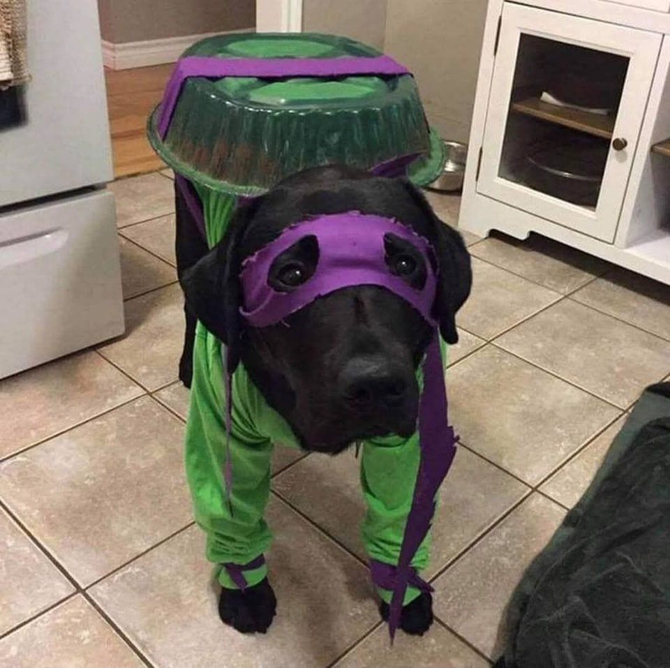

# Game DOOM-style 3D Raycasting với AI NPC

Dự án này là một game 3D raycasting được lấy cảm hứng từ *Wolfenstein 3D*, được thực hiện như một đồ án cuối kỳ môn AI. Game mô phỏng môi trường FPS (first-person shooter) với kỹ thuật raycasting để render không gian 3D trên mặt phẳng 2D. Các NPC trong game sử dụng các thuật toán tìm kiếm (như A* hoặc Dijkstra) để tìm và đuổi theo người chơi.

## Tính năng
- **Raycasting 3D**: Kỹ thuật render không gian 3D cơ bản.
- **AI NPCs**: NPC sử dụng các thuật toán tìm kiếm để tìm và đuổi theo người chơi.
- **FPS (First-Person Shooter)**: Điều khiển FPS cổ điển.
- **Môi trường maze**: Các cấp độ trong game có dạng mê cung mà người chơi phải điều hướng qua.
- **Điều khiển bằng chuột**: Cho phép người chơi nhìn xung quanh và điều hướng trong thế giới game.

## Ảnh chụp màn hình


## Thành viên nhóm
- **Nghiêm Quang Huy**: 23110222
- **Nguyễn Hoàng Hà**: 23110207

## Yêu cầu
Trước khi chạy game, bạn cần cài đặt các phần mềm sau:

- **Python 3.x**: Bạn có thể tải Python từ [đây](https://www.python.org/downloads/).
- **pygame**: Thư viện Python dùng để phát triển game.

### Cài đặt thư viện phụ thuộc:
Để cài đặt các thư viện cần thiết, sử dụng `pip`:
```bash
pip install pygame
