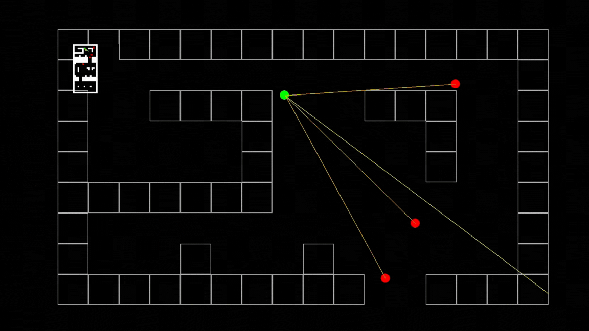

# 3D SHOOTING GAME WITH AI SEARCH ALGORITHMS FOR NPC BEHAVIOR

* HCMC University of Technology and Education
* **Course**: Artificial Intelligence
* **Supervisor**: Dr. Phan Thi Huyen Trang


This is a **first-person shooter (FPS)** game using **3D Raycasting** to simulate 3D environments on a 2D grid. A key highlight is the **smart NPCs** that can **navigate, chase, hide, and learn tactical behavior** using various AI search algorithms.




---

## 🧠 Implemented Search Algorithms & How They Work

### 🌟 A\* (A-star Search) – Efficient Pathfinding

* **Purpose**: Helps NPCs find the shortest path to a target.
* **How it works**:

  ```python
  f(current_state) = g(current_state) + h(current_state)
  ```

  * `g(current_state)`: cost from the start to current position.
  * `h(current_state)`: heuristic estimate from current to goal.
  * The algorithm selects the path with the lowest `f()` value.
* **In the game**: NPCs use A\* to navigate mazes, avoid obstacles, and reach goals intelligently.

---

### 🧠 Belief Map – Prediction Map

* **Purpose**: Allows NPCs to continue tracking the player even when they are out of sight.
* **How it works**:

  * When vision is lost, NPCs store the last seen location.
  * NPCs estimate likely positions based on prior movements.
  * They move to areas with high "belief" probability.
* **In the game**: NPCs behave more realistically and don't stop when players hide.

---

### ⛰️ Hill Climbing – Tactical Behavior

* **Purpose**: Helps NPCs make strategic choices: attack, retreat, patrol.
* **How it works**:

  * NPCs evaluate the utility of available actions.
  * Choose the highest-scoring action.
  * Stop if no better option exists (local maximum).
* **In the game**: NPCs can choose to heal when low on HP or retreat instead of fighting recklessly.

---

### 🤖 Q-Learning – Learning from Experience

* **Purpose**: Enables NPCs to learn how to find healing zones when low on HP.

* **How it works**:

  ```
  Q(s, a) = Q(s, a) + alpha * (reward + gamma * max(Q(s') - Q(s, a)))
  ```

  * `s`: current state
  * `a`: chosen action
  * `r`: reward
  * `s'`: next state
  * `α`: learning rate
  * `γ`: discount factor

* **In Python**:

  ```python
  Q[s][a] = Q[s][a] + alpha * (reward + gamma * max(Q[next_state]) - Q[s][a])
  ```

#### 🎲 ε-greedy Strategy – Balancing Exploration and Exploitation

* With probability `ε`: choose a **random action** (explore)
* With probability `1 - ε`: choose the **best known action** (exploit)
* Over time, `ε` **decreases**, shifting from exploring to exploiting

```python
epsilon = max(epsilon_min, epsilon * decay_rate)

import random
if random.uniform(0, 1) < epsilon:
    action = random.choice(possible_actions)
else:
    action = max(Q[state], key=Q[state].get)
```

---

## 🔥 Key Features

* ✅ **3D Raycasting**: Simulates 3D space on a 2D grid
* ✅ **Smart NPC behavior**: Chasing, hiding, attacking with tactics (new features)
* ✅ **Learning NPCs**: Use Q-learning to improve over time (new feature)
* ✅ **Maze challenges**: Complex navigation scenarios (new feature)
* ✅ **FPS controls**: Mouse and keyboard inputs like classic 90s shooters

---

## 👨‍💻 Developers

| Name             | Student ID |
| ---------------- | ---------- |
| Nghiem Quang Huy | 23110222   |
| Nguyen Hoang Ha  | 23110207   |

---

## 🧰 Requirements

* Python 3.x
* `pygame` library

---

## 🚀 Installation & How to Run

### 1. Clone the repository

```bash
git clone https://github.com/HuyinCP/AI_projectGame.git
```

### 2. Navigate to the project folder and run the game

```bash
python main.py
```
